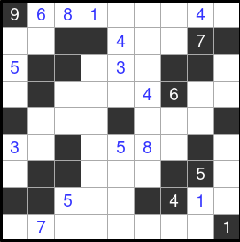

# STRAIGTS SOLVER

## ALUNOS
  André Filipe da Silva Fernandes - 19100515
  
  Hans Buss Heidemann - 19100528

Link youtube: https://youtu.be/N-BfOJ_hu28

## O PROBLEMA
  Escolhemos o puzzle Straights para implementar uma solução. O jogo consiste em um tabuleiro quadrado com casas brancas e pretas. Algumas dessas casas possuem números iniciais, e nosso objetivo é preencher o restante das casas brancas de forma que nenhuma linha
  ou coluna possua números repetidos e que cada tira contínua de números possua números em sequência, mesmo que estejam fora de ordem, por exemplo [4,1,3,2] é uma sequência válida, enquanto [4,1,5,2] não.


## SOLUÇÃO
  A estratégia utilizada para resolver o puzzle foi através do método de backtrack, em que as soluções são testadas a exaustão até que uma configuração válida apareça, e soluções inválidas são descartadas. 

  É possível imaginar os tabuleiros possíveis como uma árvore, com o tabuleiro inicial no topo e cada variação se ramifica a partir deste, então o método é uma busca em profundidade por configurações válidas. 
  
  Pensar no problema como uma árvore de possibilidades é particularmente útil ao trabalhar com linguagens funcionais dada a afinidade de árvores com algoritmos recursivos. 


## DETALHES DE IMPLEMENTAÇÂO
  Nosso tabuleiro, por facilidade, é uma lista com todos os elementos em ordem de leitura, da esquerda para a direita, de cima para baixo. 

  O programa possui uma seção só com funções auxiliares utilizadas para facilitar o acesso a listas, isolar trechos, substituir valores, verificar valores repetidos etc. Como é o caso de "steps", "slice", "repeated", etc. 

  Um outro trecho é dedicado a funções para tratar listas como matrizes. Já que como mencionado anteriormente, nosso tabuleiro é uma lista, e não uma matriz propriamente dita. Como é o caso de "get_row" e "get_col". 

  O terceiro trecho é dedicado a funções úteis para o tabuleiro e solução de fato, por exemplo identificar as casas, extrair tiras de um trecho qualquer, verificar se a tira obtida é contínua, validar coordenadas e aplicar o algoritmo de backtrack.

  Por último tem o trecho de print, com funções que retornam uma string pronta para mostrar mostrar o resultado na tela, como é o caso de "show_cell", "show_board" e "show_solution". 


I
## COMO UTILIZAR
  Para definir o tabuleiro desejado o usuário deve substituir, dentro do código, a variavel size, com o tamanho do tabuleiro e a variavel board, com os elementos em sequência. 

  Os valores seguem as seugintes regras: 
  - Espaço vazios em casas brancas são representados pelo número 0
  
  - Espaços vazios em casas pretas são representados por -10, ou pela variável x por conveniência
  
  - Casas brancas com numeradas são representadas apenas escrevendo o número desejado
  
  - E por fim, casas pretas numeradas são representadas escrevendo o valor negativo do número desejado.

  Por exemplo o tabuleiro abaixo pode ser representado da seguinte forma:

  

  ```
  size = 9 
  board = [
      -9,  6,  8,  1,  0,  0,  0,  4,  0,
       0,  0,  x,  x,  4,  0,  0, -7,  x,
      -5,  x,  x,  0,  3,  0,  x,  x,  0,
       0,  x,  0,  0,  0,  4, -6,  0,  0, 
       x,  0,  0,  0,  x,  0,  0,  0,  x,
       3,  0,  x,  0,  5,  8,  0,  x,  0, 
       0,  x,  x,  0,  0,  0,  x, -5,  0, 
       x,  x,  5,  0,  0,  x, -4,  1,  0, 
       0,  7,  0,  0,  0,  0,  0,  0, -1
      ]
  ```

Após compilar e executar o programa o resultado será printado na tela seguindo da seguinte maneira:
- Espaços vazios em casas pretas são representados por [X]

- Casas brancas numeradas são representadas simplesmente pelo número correspondente

- Casas negras numeradas são representadas com o número entre colchetes, por exemplo [7].


A solução do tabuleiro mostrado anteriormente será a seguinte:


```
$ghc -O2 --make *.hs -o main -threaded -rtsopts
[1 of 1] Compiling Main             ( main.hs, main.o )
Linking main ...
$main

[9] 6  8  1  2  5  3  4  7 
 6  5 [X][X] 4  3  2 [7][X]
[5][X][X] 4  3  2 [X][X] 8 
 7 [X] 3  2  1  4 [6] 8  9 
[X] 3  4  5 [X] 7  8  9 [X]
 3  2 [X] 6  5  8  7 [X] 4 
 2 [X][X] 8  7  6 [X][5] 3 
[X][X] 5  7  6 [X][4] 1  2 
 4  7  6  3  8  9  5  2 [1]
```

## Organização do grupo
 Nós organizamos de forma que os ambos os membros do grupo começaram tentando realizar uma implementação em Python do desáfio, após isso partimos para o Haskell. Quem implementou a maior parte do algoritmo em Haskell foi o André, mas todos os membros estavam sempre acompanhando e entendendo o desenvolvimento. Uma parte do trabalho fizemos em serviços de compartilhamento de tela para debatermos juntos. O relatório foi realizado por ambos os membros do grupo.


## Dificuldades encontradas 
Em relação ao entendimento do algoritmo não tivemos muitas dificuldades, nosso maior desafio foi estar saindo do dominio dos paradigmas que não estamos acostumados e estar realizando um projeto mais complexo em uma linguagem que não estamos acostumados. Tivemos que pensar de uma forma mais criativa para realizarmos o trabalho e sairmos da notação que estamos acostumados, como ```for, while e if```. 

Quando começamos a ter um melhor entendimento da linguagem e do paradigma as dificuldades começaram a não nós atrapalhar mais.
